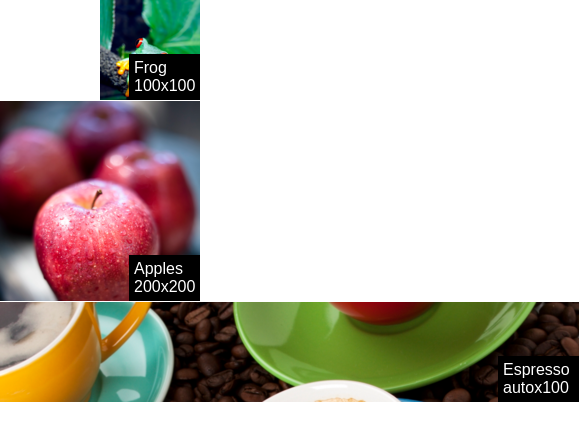

# react-samsara-demo1



# Source

```javascript
"use strict";
require("normalize.css/normalize.css");
require("samsarajs/samsara.css");

var React = require('react');
var {render, Surface} = require('react-samsara-poc');
var Samsara = require('samsarajs');

var Transform = Samsara.Core.Transform;
var Transitionable = Samsara.Core.Transitionable;

const Image = React.createClass({
  render() {
    const props = this.props;

    return (
      <node size={[undefined, undefined]}>
        <surface key="img"
                 size={[undefined, undefined]}
                 properties={{
                    backgroundImage : `url("${props.picture}")`,
                    backgroundSize : `cover`
                  }}>
        </surface>
        <node align={[1, 1]}>
          <surface key="name"
                   size={[true, true]}
                   origin={[1,1]}
                   properties={{
                    backgroundColor : `black`,
                    padding : `5px`,
                    color : 'white'
                  }}>
            {props.name}
          </surface>
        </node>
      </node>
    )
  }
});

var Example = React.createClass({

  getInitialState: function () {
    return {
      transform: new Transitionable(0)
    };
  },

  componentDidMount: function () {
    this.state.transform.set(1, {duration: 2000, curve: 'easeOutBounce'});
  },

  render: function () {
    const pos = this.state.transform.map((v) => {
      return Transform.translateX(v * 100);
    });

    return (
      <root>
        <node size={[100, 100]} transform={pos}>
          <Image name='Frog <br/> 100x100' picture='http://static.imgix.net/treefrog.jpg'/>
        </node>
        <node size={[200, 200]} transform={Transform.translateY(101)}>
          <Image name='Apples <br/> 200x200' picture='http://static.imgix.net/apples.jpg'/>
        </node>
        <node size={[undefined, 100]} transform={Transform.translateY(302)}>
          <Image name='Espresso <br/> autox100' picture='http://static.imgix.net/espresso.jpg'/>
        </node>
      </root>
    );
  }
});

render(<Example />, document.body);
```

# Run demo 

```bash
webpack-dev-server --content-base src src/Demo1.jsx
```
How to: http://jamesknelson.com/using-es6-in-the-browser-with-babel-6-and-webpack/